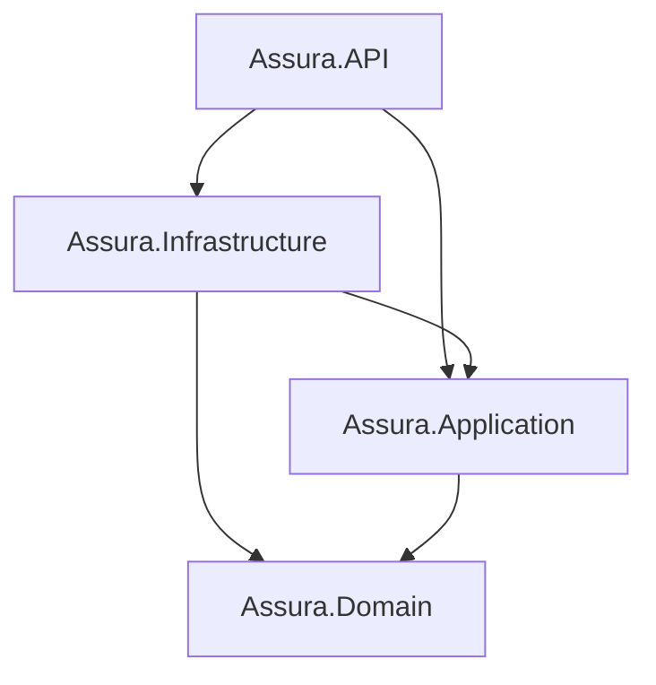

# Assura FAMS Backend

## 🚀 Overview
This is the backend for the **Fixed Assets Management System (FAMS)**, built with .NET 8 using **Clean Architecture** and **CQRS (MediatR)**.

## 🏗️ Architecture
The project follows Clean Architecture with four distinct layers:
- **Assura.Domain**: Core entities, enums, and domain logic.
- **Assura.Application**: Use cases, MediatR handlers, and interfaces.
- **Assura.Infrastructure**: EF Core, SQL Server, and External services.
- **Assura.API**: Controllers, Middleware, and API configuration.



## 📂 Folder Structure
Below is the simplified structure of the `src` directory to help you find your way:

```text
src/
├── Assura.API/                 # Presentation Layer
│   ├── Controllers/            # API Endpoints
│   ├── Middleware/             # Error handling, etc.
│   └── Program.cs              # DI & App Pipeline
│
├── Assura.Application/          # Application Layer
│   ├── Common/                 # Mappings, Interfaces
│   ├── DependencyInjection.cs  # Service registration
│   └── Features/               # CQRS Features (Logic goes here)
│       └── [FeatureName]/      # e.g., Assets, Auth
│           ├── Commands/       # Write logic
│           ├── Queries/        # Read logic
│           ├── DTOs/           # Request/Response models
│           └── Validators/     # Input validation
│
├── Assura.Domain/               # Domain Layer (Pure)
│   ├── Common/                 # BaseEntity, etc.
│   ├── Entities/               # DB Classes
│   └── Enums/                  # Constants
│
└── Assura.Infrastructure/      # Infrastructure Layer
    ├── DependencyInjection.cs  # Infrastructure DI
    ├── Persistence/            # EF Core Data Access
    │   ├── AppDbContext.cs     # Main Context
    │   ├── Configurations/     # Fluent API Mappings
    │   └── Migrations/         # DB Migrations
    └── Services/               # External implementations (Auth, Email)
```

## 📚 Documentation
For detailed guides on how to develop for this project, see:
- [**🚩 Team Onboarding & Setup**](docs/TEAM_SETUP_GUIDE.md) — **START HERE** if you just cloned the repo.
- [**Project Structure & Architecture**](docs/PROJECT_STRUCTURE.md) — Detailed folder breakdown.
- [**Coding & Implementation Guide**](docs/CONTRIBUTING.md) — How to add new features using CQRS/MediatR.


## 🛠️ Technology Stack
- **Framework**: .NET 8
- **Database**: SQL Server (EF Core)
- **Patterns**: Clean Architecture, CQRS (MediatR), Repository Pattern
- **Libraries**: AutoMapper, FluentValidation, BCrypt.Net

## 🌿 Branching Strategy & Assignments
We use a feature-branch workflow. Please work ONLY in your assigned branch and merge to `develop` via Pull Requests.

| Member | Feature Branch | Responsibilities |
| :--- | :--- | :--- |
| **THIRNAJAYA SJK** | `feature/auth-and-procurement` | Authentication, Admin/Procurement Dashboards, PO Records |
| **A.M.M.P ADIKARI** | `feature/accountant-and-superintend` | Accountant & Superintend Dashboards, Depreciation, Discarding |
| **D.M. OPANAYAKA** | `feature/storekeeper-workflow` | Storekeeper Dashboard, TIN, GRN, GIN Issuing |
| **L. KESHANI** | `feature/reporting-and-hr` | Auditor Dashboard, HR Dashboard, PDF/Excel reports, User Management |
| **W.G.S. MADHUBHASHANI** | `feature/employee-requests` | Employee/Division Head Dashboards, Asset/Transfer/Discard Requests |

## 🚦 Getting Started
1. **Clone the repo**: `git clone <repo-url>`
2. **Setup environment**: Rename `.env.example` to `.env` and update your local connection string.
3. **Switch to your branch**: `git checkout <your-assigned-branch>`
4. **Build the solution**: `dotnet build`
5. **Run the API**: `dotnet run --project src/Assura.API`

