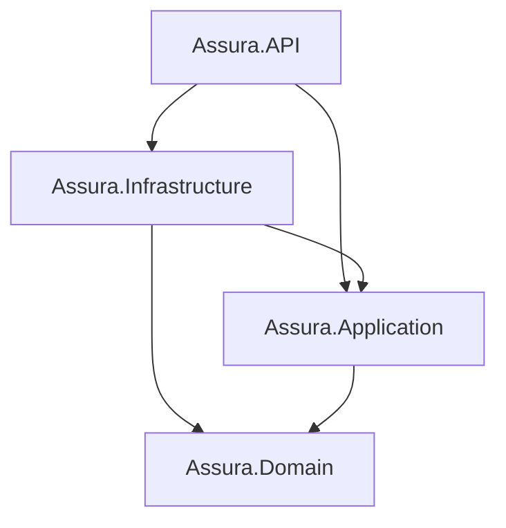

# Project Structure & Architecture

This document provides a detailed breakdown of the FAMS Backend folder structure based on **Clean Architecture**.



## 📂 Folder Structure
Below is the simplified structure of the `src` directory to help you find your way:

```text
src/
├── Assura.API/                 # Presentation Layer
│   ├── Controllers/            # API Endpoints
│   ├── Middleware/             # Error handling, etc.
│   └── Program.cs              # DI & App Pipeline
│
├── Assura.Application/          # Application Layer
│   ├── Common/                 # Mappings, Interfaces
│   ├── DependencyInjection.cs  # Service registration
│   └── Features/               # CQRS Features (Logic goes here)
│       └── [FeatureName]/      # e.g., Assets, Auth
│           ├── Commands/       # Write logic
│           ├── Queries/        # Read logic
│           ├── DTOs/           # Request/Response models
│           └── Validators/     # Input validation
│
├── Assura.Domain/               # Domain Layer (Pure)
│   ├── Common/                 # BaseEntity, etc.
│   ├── Entities/               # DB Classes (e.g., Asset, AssetSpecifications)
│   └── Enums/                  # Constants
│
└── Assura.Infrastructure/      # Infrastructure Layer
    ├── DependencyInjection.cs  # Infrastructure DI
    ├── Persistence/            # EF Core Data Access
    │   ├── AppDbContext.cs     # Main Context
    │   ├── Configurations/     # Fluent API Mappings
    │   └── Migrations/         # DB Migrations
    └── Services/               # External implementations (Auth, Email)
```

## 1. Assura.Domain
The core of the application. It contains no dependencies on any other layer.
- `/Common`: Base classes (e.g., `BaseEntity`).
- `/Entities`: Database models (e.g., `Asset`, `User`, `AssetSpecifications`).
- `/Enums`: Groupings of constants (e.g., `AssetStatus`).
- `/Interfaces`: Domain-level interfaces.

## 2. Assura.Application
Contains the business logic and defines the interfaces for functionality.
- `/Common`: Interfaces (`IApplicationDbContext`), Mappings, Behaviors.
- `/Features`: **CQRS Folders**. Each feature (e.g., Assets) has its own folder containing:
    - `/Commands`: Logic that changes state (Create, Update, Delete).
    - `/Queries`: Logic that reads data (GetById, List).
    - `/DTOs`: Data Transfer Objects for that specific feature.
    - `/Validators`: FluentValidation rules.

## 3. Assura.Infrastructure
Handles external concerns like databases, logging, and identity.
- `/Persistence`: 
    - `AppDbContext`: The EF Core context.
    - `/Configurations`: Fluent API configurations for entities.
    - `/Migrations`: Database migration history.
- `/Identity`: JWT service and Auth implementations.
- `/Services`: External integrations (e.g., Email, File Storage).

## 4. Assura.API (Presentation)
The entry point for the Web API.
- `/Controllers`: Slim controllers that delegate work to MediatR.
- `/Middleware`: Error handling and logging middleware.
- `Program.cs`: Dependency injection and pipeline configuration (uses `DotNetEnv` for MySQL/JWT).

## 5. Tests
- Separate projects corresponding to each layer (`Domain.Tests`, etc.).
- Categorized into `/Unit` and `/Integration`.
